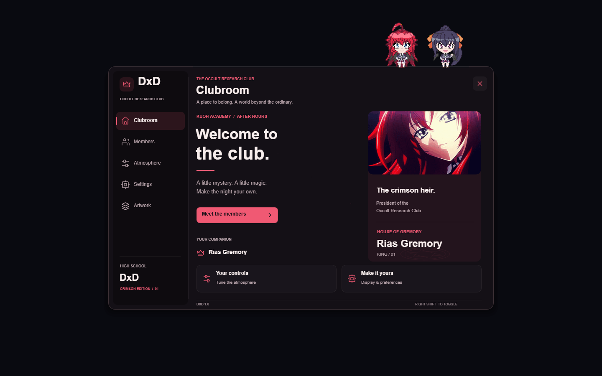

# DxD UI — Crimson Edition

A High School DxD inspired Lua interface for the **Matcha Drawing API**, based on the supplied REM UI architecture and video reference. A compact, draggable clubroom with supplied Rias Gremory and Akeno Himejima anime media and existing pixel companions, character selection, themed palettes, animated accents, reusable controls, keyboard navigation, and local visual preferences.



The preview is a capture of the actual library's Drawing output through a deterministic adapter. Fonts, compositing, and performance can differ in native Matcha. This is a Lua overlay, not a website, Roblox Studio ScreenGui, game script, or authentication system. It performs no game-state modifications.

## Run

The release is **`dxd.lua`**. It includes optimized anime frames and both pixel sprites and needs no separate asset download. Execute it directly in a compatible Matcha Lua environment, or copy it into the host workspace and run:

```lua
local UI = loadstring(readfile("dxd.lua"))()
```

Repository: [9tmr/dxd-ui](https://github.com/9tmr/dxd-ui). The single-file loader is:

```lua
local UI = loadstring(game:HttpGet("https://raw.githubusercontent.com/9tmr/dxd-ui/main/dxd.lua"))()
```

`DxD` exposes the live instance. The returned `UI` is the most reliable reference. A `Rem` compatibility alias is provided when no unrelated REM instance already occupies it. Reloading replaces only the previous DxD instance. **Right Shift** opens/closes the interface by default; closing hides it, while Settings → Unload disconnects and removes it.

Only run remotely hosted Lua you trust. To pin a reviewed version, use its commit SHA in place of `main`. The build produces `dxd.lua.sha256` for integrity comparison. No credentials or environment variables are required by the library.

## Included

- Clubroom, Members, Atmosphere, Settings, and Artwork screens.
- Independently enabled Pixel Rias / Pixel Akeno, position swapping, idle movement and click reactions.
- Three Rias selections (one clip and its opening/closing frames), six Akeno selections (three pictures, one clip and its opening/closing frames).
- Rias/Akeno selection; Gremory, Himejima, Twilight, and Obsidian palettes.
- Labels, buttons, toggles, sliders, dropdowns, custom line icons, notifications, dynamic tabs, and automatic pagination.
- Keyboard focus, Enter/Space activation, left/right adjustment, Escape dismissal, and keybind recording.
- Low/Balanced/High graphics, reduced motion, effect intensity, opacity, and explicit preference save/restore.
- Safe missing-image fallback, isolated callback failures, bounded notifications, cached drawings, and cleanup on reload/unload.
- Optional audio integration API for a caller-provided playback provider. No soundtrack or unsupported audio buttons are shipped.

## Runtime requirements and limits

Matcha must expose `Drawing.new`, `Drawing.Fonts`, `Vector2`, `Color3`, `game:GetService`, a local player mouse, `RunService.RenderStepped`, `tick`, `getfenv`, `task.spawn`, `iskeypressed`, and `ismouse1pressed`. `base64decode` enables the included art; if missing, an illustrated sigil fallback is displayed. `readfile`/`writefile` enable optional settings persistence. `isrbxactive` is used when available to ignore input in other applications.

The implementation retains REM's `Drawing.Text.Size` behavior and falls back to `FontSize` if assigning `Size` fails. Rounded squares and images use the host's `Corner` and `Rounding` properties. See the [Matcha Drawing reference](https://doc.wabisabi.mom/matcha/drawing/) and [filesystem reference](https://huoadf.github.io/matcha-docs/filesystem/).

**Character presentation is 2D.** Drawing does not provide a rigged GLB/WebGL renderer. Portrait entrance, drift, mouse parallax, and projected circle effects are implemented without pretending they are skeletal 3D, blinking, or eye-tracking. True 3D rigs require another runtime/renderer and licensed models. Audio requires a real provider and permitted tracks; see [the audio adapter contract](docs/PREFERENCES.md).

Narrow viewports reflow rows and navigation; they are tested down to 320×568. Matcha's Windows mouse/virtual-key input is the target. This does not claim native phone/touch support, HTML semantics, ARIA, or screen-reader accessibility. Very short viewports scale as a last resort. Keyboard access, contrast, and reduced-motion settings improve accessibility within the available drawing surface.

## Add controls

```lua
local UI = DxD
local Main = UI:AddTab({ Title = "My script", Icon = "script" })

local Power = Main:AddSlider({
    Title = "Effect intensity",
    Min = 0, Max = 100, Step = 5, Default = 65,
    Callback = function(value) UI:SetEffectStrength(value / 100) end,
})

Main:AddButton({
    Title = "Apply",
    ButtonText = "Apply",
    Callback = function()
        UI:Notify({ Title = "Applied", Content = "Intensity: " .. Power:GetValue(), Type = "success" })
    end,
})
Main:Select()
```

See [examples/tutorial.lua](examples/tutorial.lua) for working examples of every control. Callbacks are protected and dispatched with `task.spawn`; errors become notifications and `UI.LastError`. Callers remain responsible for the lifetime of their own tasks, connections, and game logic.

## API

| API | Behavior |
| --- | --- |
| `UI:AddTab({Title, Subtitle?, Icon?})` or `UI:AddTab("Title")` | Add/selectable tab; returns a tab |
| `Tab:AddLabel({Title, Description?, Icon?})` or `Tab:AddLabel("Text")` | Informational row |
| `Tab:AddButton({Title, Description?, ButtonText?, Callback, Disabled?})` | Action button |
| `Tab:AddToggle({Title, Default?, Callback?, Disabled?})` | Boolean value |
| `Tab:AddSlider({Title, Min, Max, Step?, Default?, Callback?, Disabled?})` | Finite, clamped, step-snapped value |
| `Tab:AddDropdown({Title, Options, Default?, Callback?, Disabled?})` | 1–128 string options, copied at construction |
| `Tab:Select()` | Show a tab; retains values and page |
| `Control:GetValue()` / `Control:SetValue(value, silent?)` | Get/set; silent updates do not fire callbacks |
| `UI:SetTheme(name)` | Set palette; returns false for unknown names |
| `UI:SetCharacter("rias" / "akeno")` | Set featured member and its default palette |
| `UI:SetKeybind(vk)` | Windows VK 8–254, excluding Escape |
| `UI:SetAvatarData(rawImageBytes)` | Optional local avatar in the brand badge, <2 MB |
| `UI:Notify({Title, Content, Type?, Duration?})` | Up to three notifications; info/success/error |
| `UI:Confirm({Title, Content, Callback})` | Confirm/cancel modal; only confirm invokes callback |
| `UI:Show()` / `UI:Hide()` / `UI:Destroy()` | Window lifecycle; Destroy is idempotent |
| `UI:GetDiagnostics()` | Drawing count, dimensions, active tab, last error |

All controls also accept `Description` and `Icon`. Built-in icon names include `home`, `gear`, `script`, `members`, `crown`, `spark`, `bolt`, `sliders`, `layers`, `power`, `key`, and `info`. Custom icons use 1–64 segments of `{x1,y1,x2,y2}` in a nominal 20×20 coordinate space; invalid coordinates are rejected before rendering.

`UI.Home`, `UI.Members`, `UI.Controls`, `UI.Gallery`, and `UI.Settings` expose the built-in tabs. Adding controls to Home/Members intentionally replaces that tab's special presentation with the standard control list. Original REM color names map to the nearest new palette: Purple→Himejima, Green→Twilight, Blue/Black→Obsidian. The original function signatures remain; the old colors and artwork are intentionally replaced.

Use the setters to change state; direct mutation of configuration fields is unsupported. The configuration file is `dxd-ui-v1.cfg` inside Matcha's workspace. Only the Save action writes it; closing does not silently save. Configurations contain allowlisted data, never executable Lua. [Full preferences documentation](docs/PREFERENCES.md).

## Companion and artwork controls

Open **Artwork**. Page 1 contains Pixel Rias, Pixel Akeno, position swapping, and animation playback. Page 2 contains both picture selectors, the independent palette selector, and Preview. Choose your featured member in Members. Save preferences in Settings to keep the selection after reloading.

```lua
UI:SetCompanionEnabled("rias", true)
UI:SetCompanionEnabled("akeno", false)
UI:SetCompanionOrder("Akeno first")
UI:SetArtwork("akeno", "Blue sky")
UI:SetArtwork("rias", "Anime loop")
UI:SetAnimatedMedia(true)
UI:SetTheme("Himejima")
UI:SaveSettings()
```

`GetArtworkOptions(character)` returns a fresh list of valid names. Invalid selections return false without changing state. Pixel sprites remain their original colors; palettes recolor the interface, preserving the supplied artwork. `ReactCompanion(character)` triggers the same reaction as a click. The sprites use position animation, not fabricated new poses or rigged animation.

## Development

Requirements: Node.js 22+ and pnpm 10+ (or npm with the same package versions). Runtime users do not need Node. Development dependencies are Fengari (real Lua execution), luaparse (Lua 5.1 syntax validation), and StyLua (formatting). There are no npm runtime dependencies.

```sh
pnpm install --frozen-lockfile
pnpm format
pnpm check
```

| Command | Purpose |
| --- | --- |
| `pnpm format` | Format Lua source, examples, and mock host |
| `pnpm format:check` | Verify Lua formatting |
| `pnpm lint` | Parse all Lua as 5.1 and check source hygiene |
| `pnpm build` | Assemble self-contained `dxd.lua` and SHA-256 |
| `pnpm test` | Behavioral tests against built `dxd.lua` |
| `pnpm check` | Formatting → syntax/hygiene → fresh production build → tests |
| `pnpm preview -- --output .preview/home.json --width 1280 --height 800` | Capture Drawing output for inspection |

`node scripts/check.cjs` runs the complete check without requiring pnpm on PATH after installation. Build before running standalone tests. This is untyped Lua, so no TypeScript-style type checker applies. Validation combines syntax parsing, runtime assertions, and behavioral tests; it is not advertised as a full semantic Lua linter.

## Architecture

```text
src/core.lua          Runtime checks, cached drawings, input targets, tabs and control API
src/preferences.lua   Safe persistence, graphics setters, optional audio provider
src/components.lua    Buttons, controls, portraits, icons, dropdowns, circle effects
src/screens.lua       Clubroom, members, control pages, modals, notifications
src/content.lua       Built-in functional tabs and preference bindings
src/render.lua        Adaptive layout, keyboard interaction and drawing pass
src/boot.lua          Initialization, frame budget, action dispatch and teardown safety
src/media.lua         Artwork catalog, companion controls and sprite rendering
assets/source/        Supplied originals and permission-confirmed artist posters
assets/characters/    Optimized stills and extracted existing pixel sprites
assets/animations/    Timed PNG frames extracted from supplied GIFs
scripts/              Build, verification and Drawing-capture tooling
tests/                Deterministic Matcha adapter and behavioral tests
dxd.lua               Committed release artifact for GitHub raw loading
```

Source modules share a lexical scope and are concatenated in a documented order by `scripts/build.cjs`. Runtime module loading is deliberately unnecessary. The generated release is committed because it is the distribution file requested by the user. Edit `src/`, then rebuild; do not hand-edit the release. The supplied source is documented in [REFERENCE-AUDIT.md](docs/REFERENCE-AUDIT.md).

Drawing objects retain property caches to minimize writes. Unused drawings expire after ten seconds. Low quality stops portrait drift and lowers ambient detail; painting is capped at 30 FPS, with 60 FPS for Balanced/High and 15 FPS while hidden/inactive. Input is polled on every host frame independently of painting. PNG frames decode once on first use and share cached bytes across views. Anime loops update at no more than 12 frames per second; Low, reduced motion, or Animated pictures off displays a still frame. A decorative image failure displays a sigil instead of crashing the app. Mouse actions dispatch after painting, preventing unload from creating orphaned drawings.

## Publish to GitHub

The release repository is `9tmr/dxd-ui`. Local development history is included in the downloadable Git bundle. Review [NOTICE.md](NOTICE.md) before redistributing. To connect a local checkout:

```sh
git remote add origin https://github.com/9tmr/dxd-ui.git
git push -u origin main
```

Open the raw `dxd.lua` URL before using the loader. For anonymous `game:HttpGet`, the file must be publicly readable. Keep tokens out of Lua and out of URLs; do not add a private GitHub token to frontend scripts. No API secrets are needed. The published raw URL is checked against the local release SHA-256 during delivery.

## Verification and troubleshooting

[VALIDATION.md](docs/VALIDATION.md) distinguishes executed automated checks from native-host checks still needed. Tests execute the complete release in Fengari against a strict Drawing/input/filesystem adapter. They cover real controls, invalid inputs, callbacks, focus, images, configuration injection, optional audio cleanup, viewport changes, and resource lifetimes. This does not reproduce native GPU rendering or prove compatibility with every Matcha build.

- **UI not visible:** press Right Shift (or your saved hotkey). Confirm the local player and Drawing API are available. Inspect the host console for `DxD stopped safely`.
- **Saved binding unknown:** remove only `dxd-ui-v1.cfg` from the host workspace, or set `DxD:SetKeybind(0xA1)` while the interface is alive.
- **No portrait:** verify `base64decode` and Image drawings. The fallback remains functional; no network download is needed.
- **Cannot save:** confirm the host's `readfile`/`writefile` availability and workspace write access. In-memory settings still work.
- **Pointer mismatch:** native DPI scaling or host mouse coordinates may differ. Verify at 100%, 125%, and 150% Windows scaling in your actual host.
- **No audio:** no soundtrack ships. Connect a real provider through `SetAudioAdapter` if you need playback.
- **Raw URL returns 404:** check repository visibility, branch/ref, case-sensitive filename `dxd.lua`, and that the file was pushed.
- **Low FPS:** select Low quality, disable ambient effects, or enable reduced motion. No GPU benchmark is claimed from the mock host.

## Assets and attribution

Both portraits were generated for this project using the built-in image-generation tool. Source prompts and provenance are in [ASSET-PROMPTS.md](docs/ASSET-PROMPTS.md). Optimized 600×800 palette PNGs are embedded in the release. The reference REM bitmap and video are not redistributed. No anime screenshots, Pinterest downloads, third-party soundtrack, model, or font files are bundled. Host system fonts are used.

This is an unofficial fan-themed interface; High School DxD character identities remain associated with their respective rights holders. User supply and confirmed sprite permission do not establish a blanket franchise license. REM-derived code attribution and the supplied archive's absent license are recorded in [NOTICE.md](NOTICE.md).
