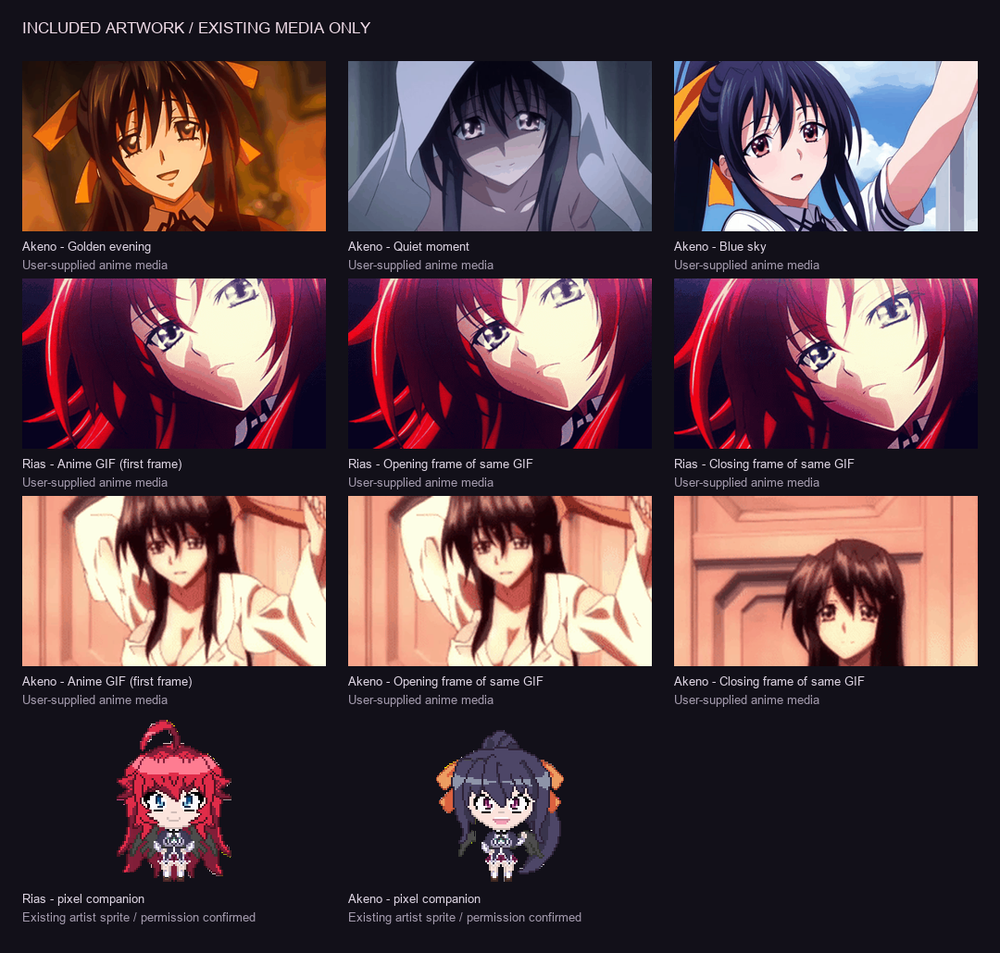

# Asset inventory

No generated character artwork is included. Original user files remain in `assets/source`; optimized copies and GIF frames are embedded in the single Lua release.

| Source file supplied by user | Project original | Use |
| --- | --- | --- |
| Akeno Himejima.jpg | akeno-evening.jpg | Quiet moment |
| ᜑㅤAkeno Himejima.jpg | akeno-uniform.jpg | Golden evening |
| download (12).jpg | akeno-sky.jpg | Blue sky |
| download (31).gif | akeno.gif | Akeno face-framed animation and two labeled stills |
| EL SER MAS PODEROSO EN DXD (TNXHAREM) - CAP 1.gif | rias.gif | Rias animation and two labeled stills |

The three Rias gallery choices are one clip and its opening/closing frames, not three different scenes. The six Akeno choices are three distinct supplied pictures, one clip and two stills from that clip.

## Existing pixel sprites

Artist: **Jarrid Lawson / Dirrajnoswal**. User confirmed permission to use both matching sprites on September 25, 2026. No public redistribution license is inferred beyond that confirmation.

- [Rias original poster](https://www.behance.net/gallery/90791551/HighSchool-DxD-Rias-Gremory-Pixel-Art)
- [Akeno original poster](https://www.behance.net/gallery/94677677/HighSchool-DxD-Akeno-Himejima-Pixel-Art)

The original attributed posters are retained as `assets/source/rias-pixel.png` and `akeno-pixel.png`. Preprocessing extracts the existing characters from the poster, removes exterior background, and resizes with nearest-neighbor sampling. It does not draw new poses or repaint character details. In-app movement is positional animation of these sprites.

## Processing and performance

`python scripts/prepare-assets.py` uses Pillow 12.3.0. Normal builds do not require Python. The manifest records image sizes and frame durations. Anime frames are 400×224 palette PNGs; each loop is sampled at no more than 12 frames/second with its overall duration preserved. Pixel companions are no larger than 150×180. Portraits preserve aspect ratio.

The runtime decodes frames lazily and shares cached bytes. Reduced motion, Low quality, or Animated pictures off uses a stable first frame. No runtime image requests, soundtrack downloads, or model downloads occur. Extra distinct artwork can be added by placing permitted source media in `assets/source`, updating preprocessing and the catalog in `src/media.lua`, and rebuilding.

